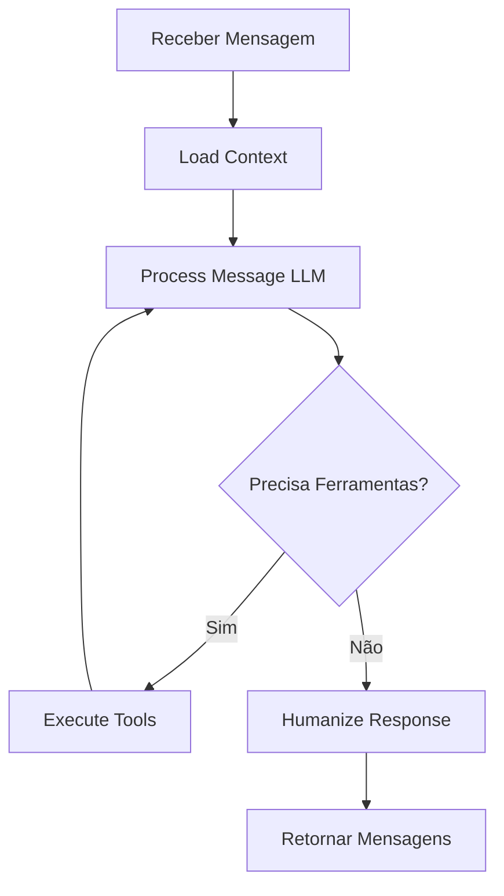

# 🤖 Engine de Agentes IA - Documentação

## Visão Geral

Sistema completo de agentes de IA usando **LangGraph** para atuar como recepcionista/secretária de clínica médica. O agente é humanizado, com quebra de mensagens, delays de digitação e memória persistente.

## 🎯 Funcionalidades

### Comportamento Humanizado

✅ **Linguagem natural**: Não robótica, empática e profissional  
✅ **Quebra de mensagens**: Máximo 150 caracteres por mensagem  
✅ **Delays de digitação**: 50ms por caractere com variação aleatória de ±20%  
✅ **Memória de janela**: Últimas 20 mensagens da conversa  
✅ **Memória persistente**: Informações do paciente (nome, plano, histórico)

### Ferramentas Disponíveis

| Ferramenta | Descrição |
|------------|-----------|
| `buscar_horarios_disponiveis` | Consulta horários livres no Google Calendar/Feegow |
| `criar_agendamento` | Cria evento no calendário e salva no banco |
| `cancelar_agendamento` | Remove do calendário e registra motivo |
| `buscar_informacoes_procedimento` | Busca procedimentos com valores e convênios |
| `escalar_para_humano` | Transfere conversa para atendente |
| `follow_up_agendar` | Agenda mensagem futura via Celery |

### Processamento de Mídia

✅ **Áudio**: Transcrição automática com Whisper  
✅ **Imagem**: Processamento com GPT-4o Vision (TODO)  
✅ **Voz**: Resposta em áudio com ElevenLabs (opcional)

## 📦 Estrutura de Arquivos

```
app/agents/
├── __init__.py                 # Exports principais
├── engine.py                   # LangGraph engine principal
├── humanizer.py                # Quebra mensagens + delays
├── memory.py                   # Memória persistente
├── voice.py                    # ElevenLabs + Whisper
└── tools/
    ├── __init__.py
    ├── calendar.py             # Agendamentos
    ├── procedures.py           # Procedimentos
    ├── escalation.py           # Escalar para humano
    └── followup.py             # Follow-ups automáticos
```

## 🔧 Configuração do Agente

### 1. Criar Agente no Banco

```python
agent = Agent(
    tenant_id=1,
    nome="Recepcionista Virtual",
    instrucoes="""
    Você é a recepcionista da Clínica Saúde Total.
    Seja sempre educada, empática e profissional.
    Ajude os pacientes a agendar consultas, tirar dúvidas sobre procedimentos
    e fornecer informações gerais.
    
    Se não souber responder algo, escale para um atendente humano.
    """,
    modelo_llm="gpt-4o",
    temperatura=0.7,
    voz_ativa=True,
    voz_id="21m00Tcm4TlvDq8ikWAM",  # ElevenLabs voice ID
    ativo=True
)
```

### 2. Configurar Ferramentas

```python
# Adicionar ferramentas ao agente
tools = [
    AgentTool(agent_id=agent.id, nome="buscar_horarios"),
    AgentTool(agent_id=agent.id, nome="criar_agendamento"),
    AgentTool(agent_id=agent.id, nome="buscar_procedimento"),
    AgentTool(agent_id=agent.id, nome="escalar")
]
```

### 3. Configurar Variáveis de Ambiente

```bash
# OpenAI
OPENAI_API_KEY=sk-...

# Anthropic (opcional)
ANTHROPIC_API_KEY=sk-ant-...

# ElevenLabs (opcional)
ELEVENLABS_API_KEY=...
```

## 💻 Uso

### Fluxo Automático (via Webhooks)

O agente é acionado automaticamente quando uma mensagem chega via webhook:

```
1. Webhook recebe mensagem
2. Worker Celery processa
3. Verifica se agente está ativo
4. Se ativo: chama AgentEngine
5. Engine processa com LangGraph
6. Humaniza resposta
7. Envia via WhatsApp
```

### Uso Programático

```python
from app.agents.engine import process_message_with_agent

# Processar mensagem
result = await process_message_with_agent(
    db=db,
    tenant_id=1,
    conversation_id=123,
    contact_id=456,
    agent_config={
        "instrucoes": "Você é uma recepcionista...",
        "modelo": "gpt-4o",
        "temperatura": 0.7,
        "ferramentas_ativas": ["buscar_horarios", "criar_agendamento"],
        "voz": {
            "ativo": True,
            "voice_id": "21m00Tcm4TlvDq8ikWAM"
        }
    },
    message={
        "tipo": "text",
        "conteudo": "Olá, gostaria de agendar uma consulta",
        "metadados": {}
    }
)

# Resultado
print(result)
# {
#     "mensagens": [
#         {"conteudo": "Olá! Claro, posso ajudar.", "delay_ms": 1200, "tipo": "text"},
#         {"conteudo": "Qual especialidade você precisa?", "delay_ms": 1500, "tipo": "text"}
#     ],
#     "acoes_executadas": [],
#     "deve_escalar": False,
#     "metadados": {"model": "gpt-4o", "total_messages": 2}
# }
```

## 🧠 Sistema de Memória

### Memória de Janela

```python
from app.agents.memory import AgentMemory

memory = AgentMemory(db, conversation_id=123)

# Buscar histórico
history = await memory.get_conversation_history()
# [
#     {"role": "user", "content": "Olá", "timestamp": "..."},
#     {"role": "assistant", "content": "Oi! Como posso ajudar?", "timestamp": "..."}
# ]
```

### Memória Persistente

```python
# Buscar informações do paciente
patient_info = await memory.get_patient_info(contact_id=456)
# {
#     "nome": "João Silva",
#     "telefone": "5511999999999",
#     "metadados": {"plano_saude": "Unimed", "data_nascimento": "1990-01-01"},
#     "total_conversas": 5,
#     "historico_assuntos": ["Agendamento", "Cancelamento", "Dúvida"]
# }

# Salvar informações
await memory.save_patient_info(contact_id=456, {
    "plano_saude": "Unimed",
    "ultima_consulta": "2026-01-15"
})
```

## 🎨 Humanização

### Quebra de Mensagens

```python
from app.agents.humanizer import MessageHumanizer

humanizer = MessageHumanizer(
    max_chars_per_message=150,
    ms_per_char=50,
    variation_percent=0.2
)

text = """
Olá! Tudo bem? Vejo que você gostaria de agendar uma consulta.
Temos horários disponíveis na segunda às 14h, terça às 10h e quarta às 16h.
Qual seria melhor para você?
"""

messages = humanizer.humanize(text)
# [
#     {"conteudo": "Olá! Tudo bem?", "delay_ms": 850, "tipo": "text"},
#     {"conteudo": "Vejo que você gostaria de agendar uma consulta.", "delay_ms": 2400, "tipo": "text"},
#     {"conteudo": "Temos horários disponíveis na segunda às 14h, terça às 10h e quarta às 16h.", "delay_ms": 3600, "tipo": "text"},
#     {"conteudo": "Qual seria melhor para você?", "delay_ms": 1500, "tipo": "text"}
# ]
```

## 🎙️ Voz (ElevenLabs + Whisper)

### Text-to-Speech

```python
from app.agents.voice import ElevenLabsVoice

voice = ElevenLabsVoice()

# Converter texto em áudio
audio_bytes = await voice.text_to_speech(
    text="Olá! Como posso ajudar?",
    voice_id="21m00Tcm4TlvDq8ikWAM"
)

# Ou em base64 (para enviar via WhatsApp)
audio_base64 = await voice.text_to_speech_base64(
    text="Olá! Como posso ajudar?",
    voice_id="21m00Tcm4TlvDq8ikWAM"
)
```

### Speech-to-Text

```python
from app.agents.voice import WhisperTranscription

whisper = WhisperTranscription()

# Transcrever áudio de URL
transcription = await whisper.transcribe_from_url(
    audio_url="https://example.com/audio.ogg"
)
print(transcription)
# "Olá, gostaria de agendar uma consulta"
```

## 🔄 LangGraph Workflow



## 🛠️ Ferramentas Detalhadas

### Calendar Tool

```python
from app.agents.tools.calendar import CalendarTool

calendar = CalendarTool(db, tenant_id=1)

# Buscar horários
slots = await calendar.buscar_horarios_disponiveis(
    data="2026-02-20",
    procedimento_id=1,
    duracao_minutos=30
)
# [
#     {"hora": "08:00", "disponivel": True, "data_hora": "2026-02-20T08:00:00"},
#     {"hora": "08:30", "disponivel": True, "data_hora": "2026-02-20T08:30:00"},
#     ...
# ]

# Criar agendamento
result = await calendar.criar_agendamento(
    contact_id=456,
    procedimento_id=1,
    data_hora="2026-02-20T14:00:00",
    observacoes="Primeira consulta"
)
# {
#     "sucesso": True,
#     "id_evento": "evt_123",
#     "mensagem": "Agendamento confirmado para 2026-02-20T14:00:00"
# }
```

### Procedures Tool

```python
from app.agents.tools.procedures import ProceduresTool

procedures = ProceduresTool(db, tenant_id=1)

# Buscar procedimento
info = await procedures.buscar_informacoes_procedimento("consulta cardiologia")
# {
#     "id": 1,
#     "nome": "Consulta Cardiologia",
#     "duracao_minutos": 30,
#     "valor": 250.00,
#     "convenios_aceitos": ["Unimed", "Bradesco Saúde"],
#     "categoria": "Consultas"
# }
```

### Escalation Tool

```python
from app.agents.tools.escalation import EscalationTool

escalation = EscalationTool(db, conversation_id=123)

# Escalar para humano
result = await escalation.escalar_para_humano(
    motivo="Cliente solicitou falar com gerente",
    urgencia="alta"
)
# {
#     "sucesso": True,
#     "mensagem": "Conversa escalada para atendente humano"
# }
```

## 📊 Monitoramento

### Métricas Importantes

- Mensagens processadas por agente
- Taxa de escalação para humano
- Tempo médio de resposta
- Taxa de conclusão de agendamentos
- Satisfação do cliente

### Logs

```bash
# Ver logs do worker
docker-compose logs -f celery_worker | grep "Agente"

# Ver processamento de mensagens
docker-compose logs -f celery_worker | grep "processou mensagem"
```

## 🚀 Próximos Passos

- [ ] Implementar integração completa com Google Calendar API
- [ ] Implementar integração com Feegow API
- [ ] Adicionar suporte a GPT-4o Vision para imagens
- [ ] Implementar function calling nativo do OpenAI
- [ ] Adicionar mais ferramentas (consultar exames, enviar resultados, etc)
- [ ] Implementar sistema de avaliação de qualidade
- [ ] Criar dashboard de analytics dos agentes
- [ ] Adicionar suporte a múltiplos idiomas

## 📚 Referências

- [LangGraph Documentation](https://langchain-ai.github.io/langgraph/)
- [OpenAI API](https://platform.openai.com/docs)
- [Anthropic Claude](https://docs.anthropic.com/)
- [ElevenLabs API](https://elevenlabs.io/docs)
- [Whisper API](https://platform.openai.com/docs/guides/speech-to-text)
